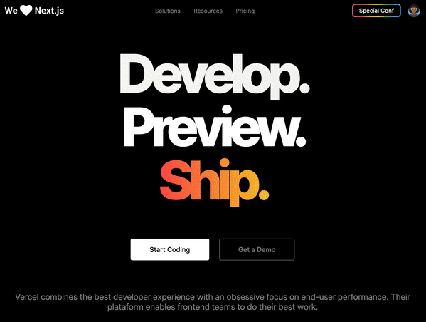

## Install and run

1. Open project folder in `VSCode`
2. Install `Live Server` and `Live Sass Compiler` extension
3. Right click `index.html` > `Open with Live Server`
4. Access the **generated address** in your browser 🚀

Thanks to [Guilherme Rodz](https://github.com/guilhermerodz)

